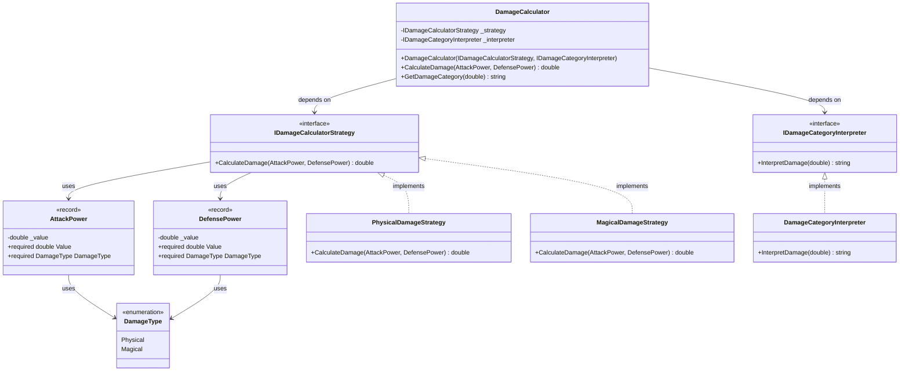

# Damage Calculator Project

## Introduction

This project implements a **Damage Calculator** system that computes damage dealt in combat scenarios based on attack power and defense power. The primary goals are to practice **SOLID design principles**, implement the **Strategy Pattern**, ensure comprehensive **unit testing**, and achieve high code coverage.

The Damage Calculator supports two damage types:
- **Physical Damage**: Uses a linear reduction formula
- **Magical Damage**: Uses a percentage-based reduction formula

Additionally, the system categorizes the computed damage into descriptive categories: Miss, Scratch, Hit, Critical, or Devastating.

## Project Structure

The project is structured into various components to ensure separation of concerns and adherence to SOLID principles. Below is the architecture diagram and breakdown of components.

## Architecture Diagram



## Component Details

### Models

#### 1. AttackPower Record

A record type representing attack power in combat.

**Properties:**
- `Value` (required, double): The attack power value with validation in the init accessor
  - **Validation**: Must be greater than zero, throws `ArgumentException` otherwise
- `DamageType` (required, DamageType): The type of damage (Physical or Magical)

**Implementation Details:**
- Uses a private backing field `_value` for the Value property
- Validation occurs in the `init` accessor when the property is set
- Modern C# pattern using `required` keyword for compile-time safety

**Usage Example:**
```csharp
var attackPower = new AttackPower
{
    Value = 100.0,
    DamageType = DamageType.Physical
};
```

#### 2. DefensePower Record

A record type representing defensive power in combat.

**Properties:**
- `Value` (required, double): The defense power value with validation in the init accessor
  - **Validation**: Must be greater than zero, throws `ArgumentException` otherwise
- `DamageType` (required, DamageType): The type of defense (Physical or Magical)

**Implementation Details:**
- Uses a private backing field `_value` for the Value property
- Validation occurs in the `init` accessor when the property is set
- Modern C# pattern using `required` keyword for compile-time safety

**Usage Example:**
```csharp
var defensePower = new DefensePower
{
    Value = 50.0,
    DamageType = DamageType.Magical
};
```

### Enums

#### DamageType Enumeration

Defines the types of damage in the system.

**Values:**
- `Physical`: Represents physical damage
- `Magical`: Represents magical damage

### Interfaces

#### 1. IDamageCalculatorStrategy Interface

Defines the contract for damage calculation strategies.

**Method:**
- `double CalculateDamage(AttackPower attackPower, DefensePower defensePower)`: Calculates damage based on attack and defense power

#### 2. IDamageCategoryInterpreter Interface

Defines the contract for interpreting damage values into categories.

**Method:**
- `string InterpretDamage(double damage)`: Returns a category description for the given damage value

### Strategies

#### 1. PhysicalDamageStrategy Class

Implements physical damage calculation using a linear reduction formula.

**Formula:** `Damage = Attack - (Defense × 0.5)`

**Validation:**
- Both AttackPower and DefensePower must have `DamageType.Physical`
- Throws `InvalidOperationException` if damage types don't match or aren't Physical

**Example:**
```csharp
var strategy = new PhysicalDamageStrategy();
var attack = new AttackPower { Value = 100, DamageType = DamageType.Physical };
var defense = new DefensePower { Value = 60, DamageType = DamageType.Physical };
var damage = strategy.CalculateDamage(attack, defense); // Returns 70.0
```

#### 2. MagicalDamageStrategy Class

Implements magical damage calculation using a percentage-based reduction formula.

**Formula:** `Damage = Attack × (100 / (100 + Defense))`

**Validation:**
- Both AttackPower and DefensePower must have `DamageType.Magical`
- Throws `InvalidOperationException` if damage types don't match or aren't Magical

**Example:**
```csharp
var strategy = new MagicalDamageStrategy();
var attack = new AttackPower { Value = 100, DamageType = DamageType.Magical };
var defense = new DefensePower { Value = 50, DamageType = DamageType.Magical };
var damage = strategy.CalculateDamage(attack, defense); // Returns 66.67
```

### Interpreters

#### DamageCategoryInterpreter Class

Interprets damage values into descriptive categories.

**Categories:**
- **Miss**: damage ≤ 0
- **Scratch**: 0 < damage < 10
- **Hit**: 10 ≤ damage < 50
- **Critical**: 50 ≤ damage < 100
- **Devastating**: damage ≥ 100

**Example:**
```csharp
var interpreter = new DamageCategoryInterpreter();
var category = interpreter.InterpretDamage(75.5); // Returns "Critical"
```

### Calculators

#### DamageCalculator Class

The main calculator class that orchestrates damage calculation and categorization.

**Dependencies:**
- `IDamageCalculatorStrategy`: Injected strategy for calculating damage
- `IDamageCategoryInterpreter`: Injected interpreter for categorizing damage

**Constructor:**
```csharp
public DamageCalculator(IDamageCalculatorStrategy strategy, IDamageCategoryInterpreter interpreter)
```

**Methods:**
- `double CalculateDamage(AttackPower attackPower, DefensePower defensePower)`: Delegates to the strategy to calculate damage
- `string GetDamageCategory(double damage)`: Delegates to the interpreter to get damage category

**Usage Example:**
```csharp
// Create attack and defense
var attack = new AttackPower { Value = 100, DamageType = DamageType.Physical };
var defense = new DefensePower { Value = 60, DamageType = DamageType.Physical };

// Create strategy and interpreter
IDamageCalculatorStrategy strategy = new PhysicalDamageStrategy();
IDamageCategoryInterpreter interpreter = new DamageCategoryInterpreter();

// Create calculator with dependency injection
var calculator = new DamageCalculator(strategy, interpreter);

// Calculate damage and get category
var damage = calculator.CalculateDamage(attack, defense); // 70.0
var category = calculator.GetDamageCategory(damage); // "Critical"
```

## Unit Testing

The project includes comprehensive unit tests covering all components:

- **Model Tests**: Validate property initialization and validation rules
- **Strategy Tests**: Verify damage calculation formulas and error handling
- **Interpreter Tests**: Confirm correct categorization across all thresholds
- **Calculator Tests**: Ensure proper delegation to strategies and interpreters using mocks

**Test Coverage Goal**: 100% code coverage to ensure every line of code is tested.

## SOLID Principles

This project demonstrates adherence to SOLID principles:

### Single Responsibility Principle (SRP)
Each class has a single, well-defined responsibility:
- `AttackPower` and `DefensePower`: Represent combat attributes with validation
- `PhysicalDamageStrategy` and `MagicalDamageStrategy`: Calculate damage using specific formulas
- `DamageCategoryInterpreter`: Categorizes damage values
- `DamageCalculator`: Orchestrates calculation and interpretation

### Open/Closed Principle (OCP)
The design is open for extension but closed for modification:
- New damage calculation strategies can be added by implementing `IDamageCalculatorStrategy`
- New interpretation logic can be added by implementing `IDamageCategoryInterpreter`
- No existing code needs modification to add new strategies


### Liskov Substitution Principle (LSP)
Any implementation of `IDamageCalculatorStrategy` or `IDamageCategoryInterpreter` can be substituted without breaking the system:
- `PhysicalDamageStrategy` and `MagicalDamageStrategy` are interchangeable
- The `DamageCalculator` works correctly with any valid strategy/interpreter implementation

### Interface Segregation Principle (ISP)
Interfaces are small and focused:
- `IDamageCalculatorStrategy`: Single method for damage calculation
- `IDamageCategoryInterpreter`: Single method for damage interpretation
- Clients only depend on the methods they actually use

### Dependency Inversion Principle (DIP)
High-level modules depend on abstractions, not concrete implementations:
- `DamageCalculator` depends on `IDamageCalculatorStrategy` and `IDamageCategoryInterpreter` interfaces
- Concrete strategies and interpreters are injected via constructor
- This enables easy testing with mocks and flexible runtime behavior

## Project Files

```
damage-calculator-core/
├── Calculators/
│   └── DamageCalculator.cs
├── Enums/
│   └── DamageType.cs
├── Interfaces/
│   ├── IDamageCalculatorStrategy.cs
│   └── IDamageCategoryInterpreter.cs
├── Interpreters/
│   └── DamageCategoryInterpreter.cs
├── Models/
│   ├── AttackPower.cs
│   └── DefensePower.cs
└── Strategies/
    ├── PhysicalDamageStrategy.cs
    └── MagicalDamageStrategy.cs

damage-calculator-core-tests/
├── Calculators/
│   └── DamageCalculatorTests.cs
├── Interpreters/
│   └── DamageCategoryInterpreterTests.cs
├── Models/
│   ├── AttackPowerTests.cs
│   └── DefensePowerTests.cs
└── Strategies/
    ├── PhysicalDamageStrategyTests.cs
    └── MagicalDamageStrategyTests.cs
```


